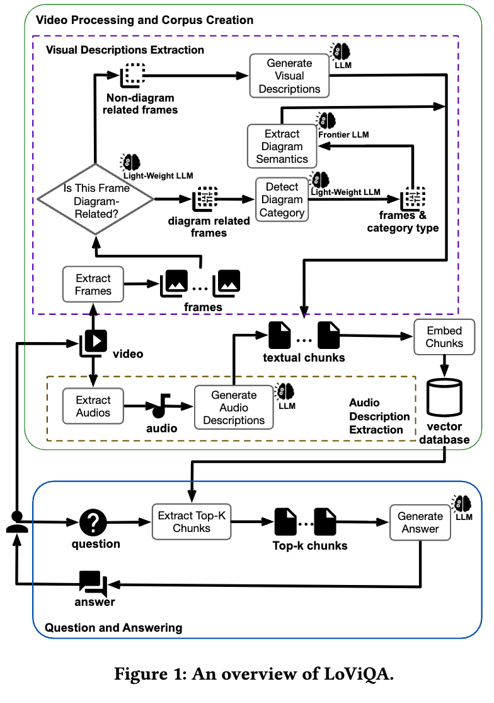

## Pipeline Overview

<p align="center">
  
</p>

<p align="center">
  <em>Figure: End-to-end workflow of LoViQA pipeline.</em>
</p>


# LoViQA

## Project Overview
The LoViQA pipeline extends the Agentic AI Hub by adding a powerful video-based question answering (VideoQA) capability. It uses:
- **GPT-4o** for question answering and non-diagram frame captioning (model name is configurable)
- **GPT-5** for diagram frame captioning with category-specific extraction prompts (configurable)
- A **lightweight LLM** (default: **GPT-4o-mini**) as a 2-stage diagram router:
  - Stage-1: diagram vs. non-diagram detection
  - Stage-2: 7-way diagram category classification to select the right extraction template
- **OpenAI-Whisper** for audio transcription

This parallel pipeline enhances interpretability, supports long-form video understanding, and is fully compatible with the existing Agentic AI Hub architecture.

---

## 1. Environment Setup

Please read the details in the Quick Start, including Python environment setup and dependency installation.

### Python Environment
This project runs on Python 3.11.10 with the following key dependencies:
- PyTorch 2.7.0
- openai 1.78.1

---

## 2. Configure API Key

The pipeline uses the official `openai` Python SDK via `openai_client.py` and reads the API key from environment variables.

Create a local `.env` (or set env vars in your shell). We provide an example at `.env.example`.

```
OPENAI_API_KEY=your_openai_api_key_here
MILVUS_URI=your_milvus_uri_here
MILVUS_TOKEN=your_milvus_token_here
MILVUS_DB_NAME=your_milvus_db_name_here(optional)
```

See `.env.example` for more details (copy it to `.env` locally).
`.env.example` also includes a **reference set of pipeline parameters** (optional) that you can modify to fit your environment.

### Milvus (RAG) Configuration

This project uses **Milvus** for RAG retrieval. Set:

- `MILVUS_URI` + `MILVUS_TOKEN` (+ optional `MILVUS_DB_NAME`)

## 3.Test each part of Pipeline 

*You need to modify the file paths in the code as commented to test the files you want to test.*

### To Test extract_frames
```sh
python test_extractedframes.py
```

### To Test Image-Description Model(GPT-4o)
```sh
python test_generate_description.py
```

### To Test whisper
```sh
python test_audio.py
```

### To Test align multimodal data
```sh
python test_align_prompt.py
```

### To Test RAG Component
```sh
python test_RAG.py
```

All the testfiles are under the folder: ```test_files/```

## 4.Running VideoQA to Process Videos and Answer Questions

### Basic Command
To start the VideoQA process, run:
```sh
python main_gpt4o.py --video <video_path> --question "<your_question>"
```

### Optional Arguments

- `--video` (required): Path to the input video (only MP4 format supported).
- `--question` (optional): Custom question. If omitted, the default question is `"Describe the video"`.
- `--max_tokens` (optional, default: `300`): Maximum token limit for the response. For complex queries, use `500+`.

### Example Usage

#### Using the Default Question (Describe the Video.)
```sh
python main_gpt4o.py --video input_videos/example.mp4
```
#### Asking a Specific Question
```sh
python main_gpt4o.py --video input_videos/example.mp4 --question "Tell me the main idea of the speaker."
```
#### Asking a Complex Question (Increasing max_tokens)

```sh
python main_gpt4o.py --video input_videos/example.mp4 --question "Summarize the entire video in detail." --max_tokens 1000
```


### If you already have the Audio Descriptions and Frame Descriptions
You can run the QA part without generating Audio Descriptions and Frame Descriptions again:
```sh
python ask_video_main_gpt4o.py --video <video_path> --question "<your_question>"
```

---

## Directory Structure
- ```main_gpt4o.py``` – full pipeline using GPT-4o (QA + non-diagram captioning) + GPT-5 (diagram captioning) + OpenAI-Whisper + Milvus RAG

- ```ask_video_main_gpt4o.py``` – ask questions with precomputed transcripts/descriptions

- ```Audio_Transcriptions/``` – saved audio transcript JSONs

- ```Frames/ – extracted``` frame images and descriptions

- ```input_videos/``` Directory where raw MP4 videos are placed

- ```RAG_Pipeline``` Contains RAG logic using text-embedding-3-large-model and Milvus backend

- ```VideoQA_Pipeline``` Core pipeline scripts and orchestration logic for VideoQA task

## 🚀 Quickstart

1. **Check Python Installation** (Python 3.11+ required)
```bash
python3.11 --version
```

2. **Create and Activate Virtual Environment**

**macOS / Linux:**
```bash
python3.11 -m venv agentic-ai-hub-env

source agentic-ai-hub-env/bin/activate
```

**Windows (PowerShell):**
```powershell
python -m venv agentic-ai-hub-env
.\agentic-ai-hub-env\Scripts\Activate.ps1
```

3. **Install Requirements**
```bash
pip install --upgrade pip

pip install -r requirements.txt
```

4. **Using the Default Question (Describe the Video.)**
```sh
python main_gpt4o.py --video input_videos/example.mp4
```

After running this command, you will generate local artifacts under `outputs/`, e.g.:

- ```✅ outputs/audio_transcriptions/```: JSON audio transcript (timestamped).

- ```🖼 outputs/frames/<video>_frames/```: extracted frames + `descriptions.json`.

- ```🧩 outputs/chunks/<video>/```: merged multimodal chunks for RAG-based answering.

---

## Data & Large Files

Lecture videos (Lecture1–Lecture5) can be downloaded from:

- [Google Drive: Lecture videos (Lecture1–Lecture5)](https://drive.google.com/drive/folders/1fsx-LroU6rXkD5BLyaseC3SUoPrm9M8U?usp=drive_link)

Place the downloaded `.mp4` files under `LoViQA/input_videos/` (or pass an absolute path via `--video`).
